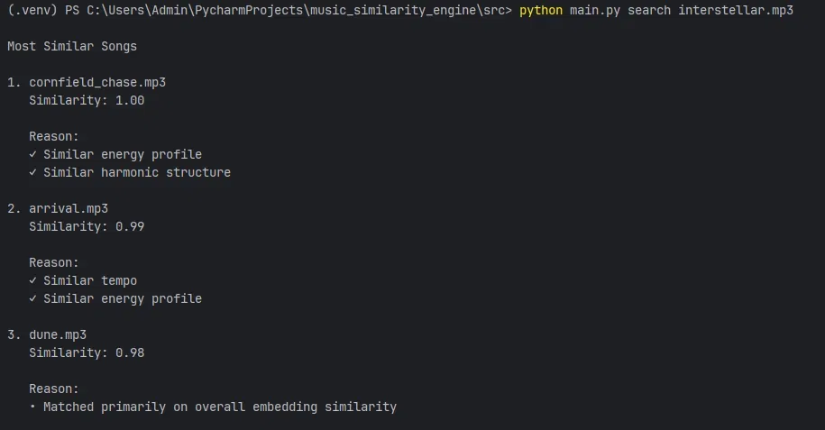
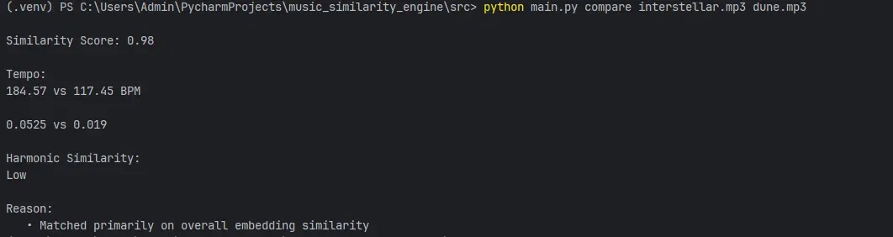
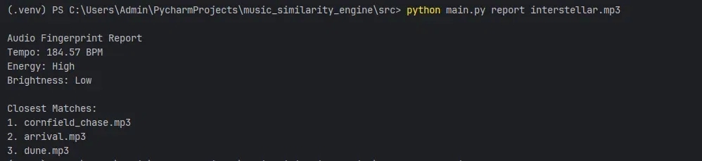
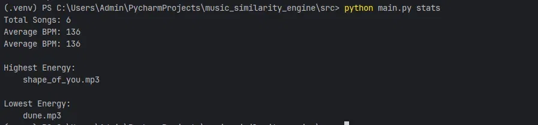

# Audio Fingerprinting & Similarity Engine

Given any song, find the most acoustically similar tracks in your library — with plain-English explanations for every match.


---

## Overview

A local music recommendation engine built from scratch — no APIs, no external databases. It analyzes raw audio files, extracts acoustic features, and uses cosine similarity to rank songs by how closely they match a query track.

The fingerprint is a **handcrafted feature vector** (BPM, MFCCs, chroma, energy, brightness) — a deliberate design choice that keeps every match explainable. An optional pretrained CNN embedding mode via OpenL3 is available as a drop-in upgrade.

---

## Features

- **Similarity search** — top-N most acoustically similar songs for any query track
- **Two-song comparison** — side-by-side breakdown of tempo, energy, and harmonic content
- **Fingerprint report** — full acoustic profile for any track in the library
- **Dataset analytics** — BPM averages and energy rankings across the library
- **Human-readable explanations** — every result tells you *why* songs are similar
- **Optional deep embedding mode** — swap in OpenL3 CNN embeddings with one flag

---

## Tech Stack

| Component | Technology |
|---|---|
| Audio feature extraction | `librosa` |
| Similarity computation | Cosine similarity (NumPy) |
| Fingerprint storage | JSON flat-file database |
| Optional deep embeddings | OpenL3 (pretrained CNN) |
| CLI interface | `argparse` |

---

## Getting Started

```bash
pip install -r requirements.txt
```

Drop `.mp3` or `.wav` files into `songs/`, then:

```bash
cd src
python main.py process
```

This extracts features from every song and saves them to `data/features.json`.

---

## Demo

### Processing a library


---

### Searching for similar songs

```bash
python main.py search interstellar.mp3
```



Returns a ranked list with similarity scores and plain-English reasons — e.g. *"Similar energy profile"*, *"Similar harmonic structure"*.

---

### Comparing two songs

```bash
python main.py compare interstellar.mp3 dune.mp3
```



Side-by-side breakdown of BPM, energy levels, harmonic similarity, and overall cosine similarity score.

---

### Fingerprint report

```bash
python main.py report interstellar.mp3
```



Full acoustic fingerprint (tempo, energy, brightness) with closest matches.

---

### Dataset analytics

```bash
python main.py stats
```



Library-wide statistics: average BPM, highest and lowest energy songs.

---

## How It Works

```
Audio File (.mp3 / .wav)
        │
        ▼
  Feature Extraction        ← librosa
  ┌─────────────────┐
  │  BPM / Tempo    │
  │  RMS Energy     │
  │  MFCCs (timbre) │
  │  Chroma (harmony)│
  │  Brightness     │
  └─────────────────┘
        │
        ▼
  L2-Normalized Fingerprint Vector
        │
        ▼
  Cosine Similarity Search  ← NumPy
        │
        ▼
  Top-N Matches + Explanations
```

1. **Extract features** — BPM, RMS energy, MFCCs, chroma, and spectral brightness extracted per song using `librosa`.
2. **Build a fingerprint** — features concatenated into a single vector and L2-normalized. Handcrafted by design — fully interpretable.
3. **Search** — cosine similarity computed between the query vector and every stored fingerprint.
4. **Explain** — raw features compared directly to generate plain-English match reasons.

> Set `USE_PRETRAINED = True` in `embedding_generator.py` to swap in OpenL3 CNN embeddings. Falls back to the handcrafted vector if OpenL3 isn't installed.

---

## Project Structure

```
music_similarity_engine/
├── songs/                       # Drop your .mp3 / .wav files here
├── data/
│   └── features.json            # Auto-generated fingerprint database
├── src/
│   ├── feature_extractor.py     # BPM, MFCCs, chroma, energy, brightness
│   ├── embedding_generator.py   # Handcrafted vector + optional OpenL3 mode
│   ├── similarity_engine.py     # Cosine similarity search
│   ├── explainability.py        # Plain-English match reasoning
│   └── main.py                  # CLI entry point
├── assets/                      # Screenshots
└── README.md
```

---

## CLI Reference

| Command | Description |
|---|---|
| `python main.py process` | Extract and store features for all songs in `songs/` |
| `python main.py search <song>` | Find top-N most similar songs |
| `python main.py compare <song1> <song2>` | Side-by-side acoustic comparison |
| `python main.py report <song>` | Full fingerprint report for one track |
| `python main.py stats` | Dataset-wide analytics |

---

## Design Decisions

**Why a handcrafted feature vector instead of a deep embedding?**

Handcrafted features (BPM, MFCCs, chroma, energy) make similarity scores explainable. When the engine says two songs match, it can say *why* — matching tempo, shared harmonic content, comparable energy. A deep embedding collapses all that signal into a single opaque vector, making the explainability layer impossible.

The OpenL3 mode exists as an opt-in upgrade for when retrieval accuracy matters more than interpretability.

---

## Roadmap

- [ ] Web UI with drag-and-drop upload
- [ ] Playlist generation from a seed track
- [ ] Support for `.flac` and `.ogg` formats
- [ ] Genre classification as an additional feature dimension
